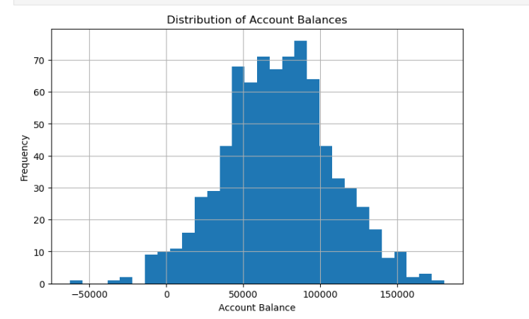
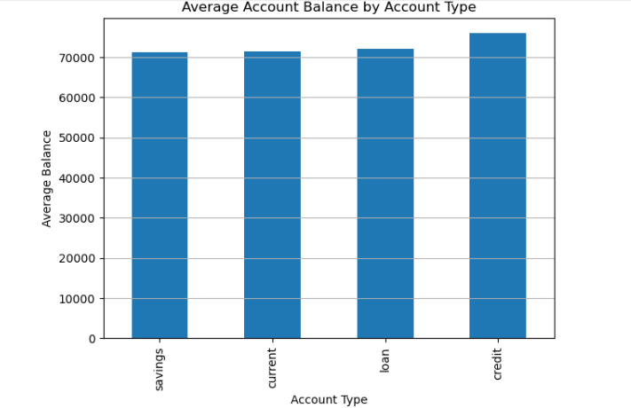
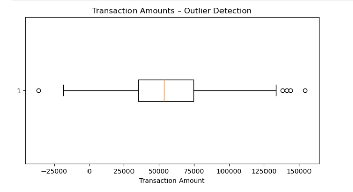

# Financial_Risk_Analysis_With_PythonTool
💰 Financial Risk Analysis (Python Tool)

📌 Overview

This project analyzes financial data to assess risk levels and identify potential financial instability using Python-based data analysis techniques.

⸻

🎯 Problem Statement

Financial institutions need to evaluate risk factors such as volatility, returns, and exposure to make informed decisions and reduce potential losses.

⸻

⚙️ Tools & Technologies
	•	Python
	•	Pandas
	•	NumPy
	•	Matplotlib / Seaborn

⸻

🔍 Features

✔ Data Cleaning & Preprocessing
✔ Risk Analysis (returns, volatility)
✔ Data Visualization
✔ Insight Generation

⸻

📊 Key Analysis Performed
	•	Calculation of balance volatility per account
	•	Identification of high-risk events
	•	Trend analysis using visualizations
  
## 📈 Visual Insights

### 📊 Account Balance Distribution

### 📊 Average Balance by Account Type

### 📊 Outlier Detection

📁 Files Included
	•	financial_risk_analysis.ipynb → Python notebook
	•	dataset.csv → Input data
	•	financial_Risk_Identification.ipynb → Python notebook
	•	Visualization.ipynb → Python notebook

  🎯 Key Insights
	•	Identified high volatility periods
	•	Highlighted risky events
	•	Observed trends in financial performance

  🚀 Future Improvements
	•	Add machine learning model for risk prediction
	•	Real-time data integration
💻 Sample Code
# Identify frequent large withdrawals and overdraft incidents

# Standardize transaction type
df['TransactionType'] = df['TransactionType'].str.lower().str.strip()

# Define large withdrawal threshold (95th percentile)
large_withdrawal_threshold = df.loc[
    df['TransactionType'] == 'withdrawal', 'TransactionAmount'
].quantile(0.95)

# Flag large withdrawals
df['large_withdrawal_flag'] = (
    (df['TransactionType'] == 'withdrawal') &
    (df['TransactionAmount'] >= large_withdrawal_threshold)
)

# Flag overdraft incidents (negative balance)
df['overdraft_flag'] = df['AccountBalance'] < 0

# Count risk events per account
risk_events = (
    df.groupby('AccountID')[['large_withdrawal_flag', 'overdraft_flag']]
      .sum()
      .reset_index()
)

risk_events.head()

🙌 Author

Shruti Sahu

